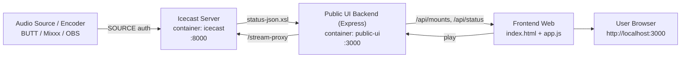

# Dokumentasi Skema & Alur Integrasi Icecast ke Web

Dokumen ini menjelaskan bagaimana **Icecast** terhubung ke **website eRKS FM** pada project ini, termasuk arsitektur, alur request, endpoint, dan langkah verifikasi.

## 1. Ringkasan Arsitektur

- `icecast` container: server streaming audio (port internal `8000`, dipublish ke host `8099`)
- `public-ui` container: web frontend + backend Express kecil (port `3000`)
- Browser user membuka web di `http://localhost:3000`
- Web mengambil metadata siaran dari Icecast via API internal
- Audio diputar melalui endpoint proxy agar kompatibel browser

## 2. Skema Sistem



## 3. Alur Data End-to-End

1. Encoder mengirim audio stream ke Icecast mountpoint (mis. `/live`).
2. Icecast mempublikasikan metadata/status di `status-json.xsl`.
3. Backend web (`public-ui/server.js`) memanggil status Icecast lewat env:
   - `ICECAST_URL=http://icecast:8000/status-json.xsl`
4. Frontend memanggil endpoint internal:
   - `GET /api/mounts` untuk daftar mount + info program
   - `GET /api/status` untuk status mentah Icecast
5. Saat user klik play:
   - Frontend resolve URL playlist via `GET /api/resolve?url=...`
   - Playback diarahkan ke `GET /stream-proxy?url=...`
6. Endpoint `stream-proxy` meneruskan stream dari Icecast ke browser agar:
   - same-origin lebih aman
   - potensi masalah CORS lebih kecil
   - rewrite `localhost:8099` ke host Docker internal `icecast:8000` bila perlu

## 4. Endpoint yang Dipakai Web

- `GET /api/status`
  - Ambil status Icecast mentah
- `GET /api/mounts`
  - Ambil mount list yang sudah dinormalisasi untuk UI
- `GET /api/resolve?url=<stream_url>`
  - Resolve playlist `.m3u/.m3u8/.xspf` ke stream URL final
- `GET /stream-proxy?url=<stream_url>`
  - Proxy stream audio ke browser

## 5. Konfigurasi Docker Compose (Aktif Saat Ini)

- Icecast:
  - Service: `icecast`
  - Host port: `8099`
  - Container port: `8000`
- Public UI:
  - Service: `public-ui`
  - Host port: `3000`
  - Env penting:
    - `ICECAST_URL=http://icecast:8000/status-json.xsl`

## 6. Checklist Agar Koneksi Icecast -> Web Berhasil

1. Jalankan container:

```bash
docker compose up -d --build
```

2. Pastikan service up:

```bash
docker compose ps
```

3. Verifikasi Icecast hidup:
- Buka `http://localhost:8099/`

4. Verifikasi API web membaca Icecast:
- Buka `http://localhost:3000/api/mounts`
- Harus return JSON `mounts` (minimal array kosong jika belum ada source)

5. Verifikasi playback:
- Buka `http://localhost:3000/`
- Klik tombol play di player
- Cek suara keluar dan status berubah ke live

## 7. Troubleshooting Singkat

- `mounts` kosong:
  - Encoder/source belum push ke Icecast mountpoint.
- `502 Failed to fetch from Icecast`:
  - Service `icecast` belum up atau env `ICECAST_URL` salah.
- Tombol play gagal:
  - Browser memblok autoplay, coba klik manual lagi.
  - URL stream belum valid, cek hasil `/api/resolve`.
- Audio putus-putus:
  - Cek bitrate source, jaringan, dan resource container.

## 8. Rekomendasi Produksi

- Ganti credential default di `icecast.xml` (`source-password`, `admin-password`).
- Tambahkan reverse proxy (Nginx/Caddy) + HTTPS.
- Tambahkan monitoring log untuk `icecast` dan `public-ui`.
- Gunakan domain publik untuk `ICECAST_PUBLIC_BASE` bila diperlukan.

---
Dokumen ini dibuat sesuai implementasi repository saat ini pada tanggal **31 Mei 2026**.
