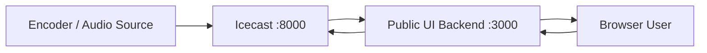

# eRKS FM Sumedang Radio Streamer

Website radio online modern untuk **eRKS FM Sumedang 106.1 FM - Inspirasi Sumedang**. Project ini menggabungkan server streaming Icecast dengan public web UI berbasis Express dan frontend statis.

## Fitur

- Icecast2 streaming server via Docker
- Public radio website di port `3000`
- Live player dengan play/pause, volume control, metadata siaran, dan equalizer animasi
- Proxy stream audio agar lebih mudah diputar browser
- API status dan mount Icecast untuk frontend
- Desain responsive untuk desktop dan mobile

## Arsitektur Singkat



## Struktur Project

```text
.
├── Dockerfile
├── docker-compose.yml
├── icecast.xml
├── icecast-public-ui/
│   ├── Dockerfile
│   ├── package.json
│   ├── server.js
│   └── public/
│       ├── index.html
│       ├── style.css
│       └── app.js
└── DOKUMENTASI_ALUR_ICECAST_WEB.md
```

## Menjalankan dengan Docker

Build dan jalankan semua service:

```bash
docker compose up -d --build
```

Cek status container:

```bash
docker compose ps
```

Stop container:

```bash
docker compose down
```

## Akses Layanan

- Website radio: `http://localhost:3000`
- Status Icecast: `http://localhost:8099`
- Admin Icecast: `http://localhost:8099/admin`

## Endpoint Public UI

- `GET /api/status` untuk status mentah Icecast
- `GET /api/mounts` untuk daftar mount yang dipakai frontend
- `GET /api/resolve?url=<stream_url>` untuk resolve playlist stream
- `GET /stream-proxy?url=<stream_url>` untuk proxy audio stream

## Konfigurasi Penting

Konfigurasi utama Icecast berada di [icecast.xml](icecast.xml). Pastikan nilai password source, relay, dan admin disesuaikan sebelum dipakai produksi.

Environment yang dipakai service `public-ui`:

```bash
ICECAST_URL=http://icecast:8000/status-json.xsl
ICECAST_PUBLIC_BASE=http://localhost:8099
```

Jika Icecast diakses lewat Nginx Proxy Manager atau domain publik, set `ICECAST_PUBLIC_BASE` ke URL publik stream, contoh:

```bash
ICECAST_PUBLIC_BASE=https://stream.domain.go.id
```

## Dokumentasi Alur

Dokumentasi detail koneksi Icecast ke web tersedia di [DOKUMENTASI_ALUR_ICECAST_WEB.md](DOKUMENTASI_ALUR_ICECAST_WEB.md).

## Catatan Produksi

- Gunakan HTTPS melalui reverse proxy seperti Nginx atau Caddy.
- Jangan commit file `.env` atau credential sensitif.
- Sesuaikan hostname dan public base URL jika deploy ke domain publik.
- Monitor log Icecast dan public UI untuk memastikan stream stabil.
