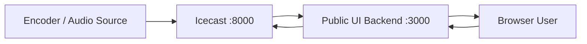

# eRKS FM Sumedang Radio Streamer

Website radio online modern untuk **eRKS FM Sumedang 106.1 FM - Inspirasi Sumedang**. Project ini menggabungkan server streaming Icecast dengan public web UI berbasis Express dan frontend statis.

## Fitur

- Icecast2 streaming server via Docker
- Public radio website di port `3000`
- Live player dengan play/pause, volume control, metadata siaran, dan equalizer animasi
- Proxy stream audio agar lebih mudah diputar browser
- API status dan mount Icecast untuk frontend
- CMS admin untuk mengatur daftar media automation dan konten website
- Desain responsive untuk desktop dan mobile

## Arsitektur Singkat



## Struktur Project

```text
.
├── Dockerfile
├── docker-compose.yml
├── icecast.xml
├── icecast-public-ui/
│   ├── Dockerfile
│   ├── package.json
│   ├── server.js
│   └── public/
│       ├── index.html
│       ├── style.css
│       └── app.js
└── DOKUMENTASI_ALUR_ICECAST_WEB.md
```

## Menjalankan dengan Docker

Build dan jalankan semua service:

```bash
docker compose up -d --build
```

Cek status container:

```bash
docker compose ps
```

Stop container:

```bash
docker compose down
```

## Akses Layanan

- Website radio: `http://localhost:3000`
- Status Icecast: `http://localhost:8099`
- Admin Icecast: `http://localhost:8099/admin`

## Endpoint Public UI

- `GET /api/status` untuk status mentah Icecast
- `GET /api/mounts` untuk daftar mount yang dipakai frontend
- `GET /api/resolve?url=<stream_url>` untuk resolve playlist stream
- `GET /stream-proxy?url=<stream_url>` untuk proxy audio stream
- `GET /api/automation-media` untuk daftar media automation yang sedang aktif
- `GET /api/site-content` untuk konten website seperti program, jadwal, berita, penyiar, dan galeri

## Konfigurasi Penting

Konfigurasi utama Icecast berada di [icecast.xml](icecast.xml). Pastikan nilai password source, relay, dan admin disesuaikan sebelum dipakai produksi.

Environment yang dipakai service `public-ui`:

```bash
ICECAST_URL=http://icecast:8000/status-json.xsl
ICECAST_BASE=http://icecast:8000
ICECAST_PUBLIC_BASE=http://localhost:8099
DATA_DIR=/app/data
CMS_ADMIN_USER=admin
CMS_ADMIN_PASSWORD_HASH=<salt:hash>
SESSION_SECRET=<random-secret>
```

Jika Icecast diakses lewat Nginx Proxy Manager atau domain publik, set `ICECAST_PUBLIC_BASE` ke URL publik stream, contoh:

```bash
ICECAST_PUBLIC_BASE=https://stream.domain.go.id
```

## CMS Automation Media

CMS dapat diakses melalui:

```text
http://localhost:3000/admin
```

Untuk membuat password hash admin:

```bash
cd icecast-public-ui
npm run hash-password -- "password-kuat"
```

Masukkan output hash ke environment:

```bash
CMS_ADMIN_USER=admin
CMS_ADMIN_PASSWORD_HASH=<output-hash>
SESSION_SECRET=<random-secret-panjang>
```

Data CMS disimpan di SQLite:

```text
data/erks-cms.sqlite
```

Database ini berada di volume Docker `./data:/app/data`, sehingga data CMS tetap aman saat container `public-ui` di-recreate.

Metode play yang tersedia di CMS:

- `Berdasarkan Jam`: media aktif pada hari/jam tertentu.
- `Queue / Antrean`: media dipilih berdasarkan urutan queue.
- `Prioritas`: media dengan nilai prioritas tertinggi dipilih lebih dulu.
- `Loop`: media masuk daftar loop untuk diputar berulang oleh engine automation.

Endpoint publik untuk sistem automation:

```text
GET /api/automation-media
GET /api/automation-media/next
```

`/api/automation-media` mengembalikan `items`, `groups`, dan `nextItem`. Urutan pemilihan `nextItem` adalah `schedule`, lalu `queue`, lalu `priority`, lalu `loop`.

CMS juga dapat mengisi section website berikut:

- Program Hari Ini
- Jadwal Siaran
- Berita Terbaru
- Profil Penyiar
- Galeri & Video

## Dokumentasi Alur

Dokumentasi detail koneksi Icecast ke web tersedia di [DOKUMENTASI_ALUR_ICECAST_WEB.md](DOKUMENTASI_ALUR_ICECAST_WEB.md).

## Catatan Produksi

- Gunakan HTTPS melalui reverse proxy seperti Nginx atau Caddy.
- Jangan commit file `.env` atau credential sensitif.
- Sesuaikan hostname dan public base URL jika deploy ke domain publik.
- Monitor log Icecast dan public UI untuk memastikan stream stabil.


user : admin 
pass : kBYiG9HBstbIFYZ_bKHMaW7w
